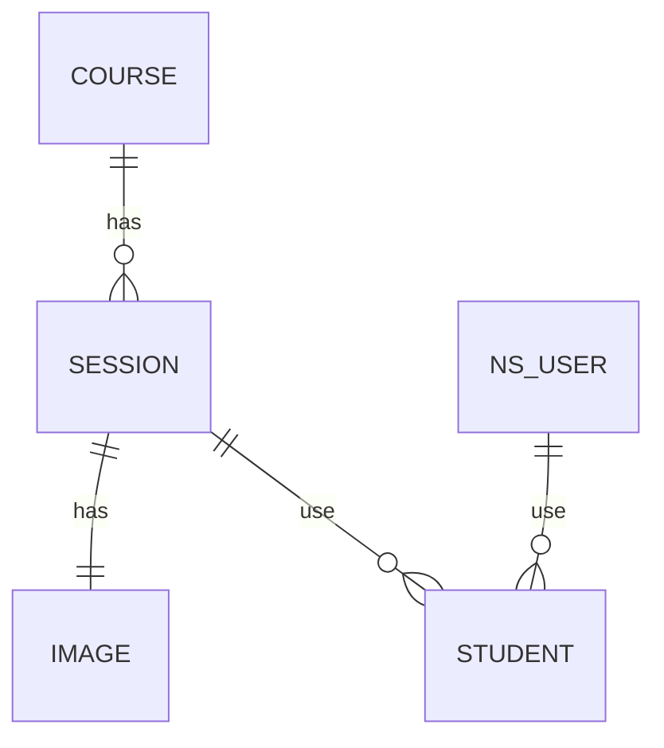

# 학습 관리 시스템(Learning Management System)

## 진행 방법

* 학습 관리 시스템의 수강신청 요구사항을 파악한다.
* 요구사항에 대한 구현을 완료한 후 자신의 github 아이디에 해당하는 브랜치에 Pull Request(이하 PR)를 통해 코드 리뷰 요청을 한다.
* 코드 리뷰 피드백에 대한 개선 작업을 하고 다시 PUSH한다.
* 모든 피드백을 완료하면 다음 단계를 도전하고 앞의 과정을 반복한다.

## 온라인 코드 리뷰 과정

* [텍스트와 이미지로 살펴보는 온라인 코드 리뷰 과정](https://github.com/next-step/nextstep-docs/tree/master/codereview)

## To-Do List

* Course class 생성 [X]
* Session class 생성 [X]
* FreeSession class 생성 [X]
* PaidSession class 생성 [X]
* Image class 생성 [X]
* Image size 및 width,height 비율 체크 로직 [X]
* Session과 Image 연관 관계 설정 [X]
* 과정에 강의 추가 로직 개발 [X]
* 강의 생성 로직 개발 [X]
* SessionDate class 생성 [X]
* SessionCapacity class 생성 [X]
* Money class 생성 [X]
* 과정 생성 로직 개발 [X]
* 무료 강의 신청 로직 개발 [X]
* 유료 강의 신청 로직 개발 [X]
* 강의 상태 변경 로직 개발 [X]
* 과정에 강의 추가 로직 개발 [X]
* SessionId class 삭제 [X]
* Student class 생성 [X]
* PaidSession의 수강 학생수를 이용해서 SessionCapacity의 currentCount 업데이트하도록 로직 수정 [X]
* erd 작성 [X]
* Course 테이블 추가 [X]
* Session 테이블 추가 [X]
* Image 테이블 추가 [X]
* Student 테이블 추가 [X]
* Course crud 로직 [X]
* Session crud 로직 [X]
* Student crud 로직 [X]
* Image crud 로직 [X]
* Session 생성 서비스 로직 [X]
* Session 수강신청 서비스 로직 [X]
* Session 조회 서비스 로직 [X]
* Course 생성 서비스 로직 [X]
* Course 조회 서비스 로직 [X]
* 강의가 하나 이상의 이미지를 가질 수 있도록 변경 []
    * Course class에 List<Image> images field 추가 [X]
    * 한개의 image가 아니라 여러개의 image들을 받아서 PaidSession, FreeSession 생성하도록 변경 [X]
    * ImageRepository에서 여러개의 image들을 반환 받도록 변경 [X]
    * Course class에서 Image image field 제거 []
* 강의 상태를 진행 상태(준비중,진행중,종료)와 모집 상태(비모집중,모집중)으로 분리 []
    * Session class에 진행 상태, 모집 상태 field 추가 []
    * Session class 생성 로직에서 진행 상태, 모집 상태 만들도록 변경 []
    * Session class에서 SessionStatus field 제거 []
* 강사 class 추가 []
* Student class에 수강 상태(신청,승인,취소) 추가 []
* 강사가 수강 신청한 학생들을 승인할 수 있는 로직 추가 []

## ERD

